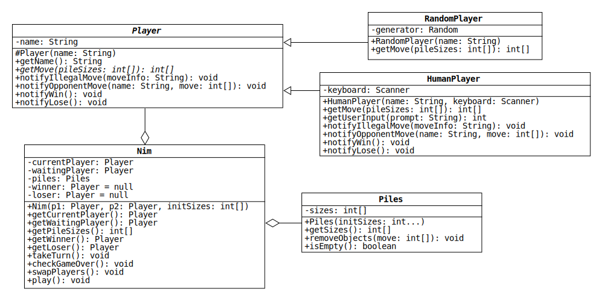
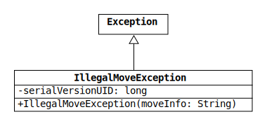

# Lab 7: Nim with Polymorphic Players

[Nim](https://en.wikipedia.org/wiki/Nim) is an ancient two-player strategy game that is played with a collection of identical objects organized into piles.
The number and sizes of the piles can change from game to game, but 3-4-5 and 1-3-5-7 are commonly used.
Players take turns removing one or more objects from any single pile until none remain.
The loser is the player that removes the last object.

In this lab, we will use our newly acquired knowledge of exceptions and abstract classes to write a Nim video game!
Below is example output from the game in which I vanquish my computer opponent, RandomPlayer.
After passing the unit tests, you can challenge RandomPlayer yourself by writing a driver class with a five-line main method.

```text
Piles: [3, 4, 5]
Enter pile index: 0
Enter object number: 2
RandomPlayer removed 3 from pile 2.

Piles: [1, 4, 2]
Enter pile index: 1
Enter object number: 1q
Enter object number: 1
RandomPlayer removed 1 from pile 0.

Piles: [0, 3, 2]
Enter pile index: 1
Enter object number: 0
Nonpositive object number: 0

Piles: [0, 3, 2]
Enter pile index: 1
Enter object number: 1
RandomPlayer removed 2 from pile 2.

Piles: [0, 2, 0]
Enter pile index: 1
Enter object number: 1
RandomPlayer removed 1 from pile 1.

Nice job, Mukhtar. You win!
```

## Program Overview

The structure of the program is shown in the UML diagram below.
(See the PDF in the uml folder for a larger version.)
The Nim class uses the Player and Piles classes to simulate a game of Nim.
Each Nim object contains two Player objects and one Piles object.



The Player class is abstract, which is indicated by italicized font.
It has one abstract method, getMove, that is overridden in its two non-abstract (concrete) subclasses: RandomPlayer and HumanPlayer.

Much of the code in these classes has already been written for you.
The Player class in your repo is complete, and the Nim and HumanPlayer classes are each only missing a single method.

## Custom Exception Class

Take another look at the example output in the introduction.
Notice that the game is able to recover from my invalid input on moves two and three.

On my second move, I entered "1q" instead of an integer, which caused the game to prompt me for an object number twice.
On my third move, I tried to avoid taking any objects by entering an object number of 0.
This is an illegal move, so the game asked me for a different move.

This resilient behavior is accomplished by throwing and catching exceptions.
To facilitate it, we will write a custom exception class, which is shown in the diagram below.



IllegalMoveException extends the Java API [Exception class](https://docs.oracle.com/en/java/javase/11/docs/api/java.base/java/lang/Exception.html) and is thrown by the Piles method removeObjects when given an illegal move.
The constructor takes a String argument with information about the move and passes it to the [one-argument parent constructor](https://docs.oracle.com/en/java/javase/11/docs/api/java.base/java/lang/Exception.html#%3Cinit%3E(java.lang.String)).
The String can be retrieved later by calling the inherited method [getMessage](https://docs.oracle.com/en/java/javase/11/docs/api/java.base/java/lang/Throwable.html#getMessage()).

Because Exception implements the [Serializable interface](https://docs.oracle.com/en/java/javase/11/docs/api/java.base/java/io/Serializable.html), any subclass should declare a field named "serialVersionUID".
If the field is not declared, the compiler will generate a warning, which will cause your code to fail the zyLab tests.
To eliminate the warning, add the following line to IllegalMoveException:

```java
private static final long serialVersionUID = 1L;
```

You can make Eclipse do this for you by hovering over the class name and selecting "Add default serial version ID" or "Add generated serial version ID" from the context menu.
The value of the field is arbitrary, but it needs to be a long integer, which is indicated by appending `L` to the number.

## Piles Class

Piles represents the piles of identical objects in a game of Nim.
The class encapsulates the pile sizes and throws exceptions to enforce the rules of the game.

* `Piles(int... initSizes)`: Initialize a new Piles object with the sizes in the given array.
Copy the array to ensure that the sizes can only change by calling removeObjects.

  The constructor should throw an IllegalArgumentException if either of the following conditions is true:

  1. The array reference is null or the array has zero length.
  2. Any element of the array is not positive.
  (None of the piles can initially be empty.)

* `getSizes()`: Return an array with the current pile sizes.
Make a copy of the sizes field before returning it to protect the data.

* `removeObjects(int[] move)`: Remove objects from one of the piles.
The input is a two-element array that represents a player's move.
The array has the format [index, number].
The first element is the index of one of the piles.
The second element is the number of objects to remove.

  The method should throw an IllegalMoveException if any of the conditions listed below is true.
  Check the conditions in the given order.

  1. If the array reference is null, throw an IllegalMoveException with the message `"null move"`.

  2. If the array has a length other than 2, use the message `"Invalid length: <length>"`.

  3. If the pile index is out of bounds, use the message `"Index out of bounds: <index>"`.

  4. If the pile has a size of 0, use the message `"Pile <index> is empty."`.

  5. If the object number is less than or equal to 0, use the message `"Nonpositive object number: <number>"`.

  6. If the object number is greater than the pile size, use the message `"Object number greater than pile size: <number> > <size>"`.

  In each of these messages, the substrings that start with `<` and end with `>` should be replaced with the corresponding values.
  For instance, if an array of length 1 is passed to removeObjects, the exception message would be `"Invalid length: 1"`.

* `isEmpty()`: Return true if all the piles are empty.
Otherwise, return false.

## Player Class

The abstract Player class provides a common set of methods that the Nim class uses to interact with all Player subclasses.
The most important of these is the abstract method getMove, which must be overridden by any non-abstract subclass.
This method takes an array of pile sizes and returns a two-element array that represents a player's move.
The move array has the same format described in the previous section: [pile index, object number].

The remaining Player methods are all non-abstract.
Most of them are used by Nim to notify a player that something important has happened (e.g., they've won the game).
Subclasses of Player can choose to override these methods to implement special behavior.
For example, HumanPlayer uses these methods to print information to the console.

Your repo contains a complete version of the Player class.
You do not need to modify any of the code.
However, please take a few minutes to study it before trying to write the methods described in the next sections.

## RandomPlayer Class

RandomPlayer is a subclass of Player that makes choices with a [random number generator](https://docs.oracle.com/en/java/javase/11/docs/api/java.base/java/util/Random.html).
It does not override any of the non-abstract Player methods.

* `RandomPlayer(String name)`: Pass the name to the parent constructor and initialize the generator field by calling the [no-argument Random constructor](https://docs.oracle.com/en/java/javase/11/docs/api/java.base/java/util/Random.html#%3Cinit%3E()).

* `getMove(int[] pileSizes)`: Return a random legal move.
(Hint: Use the Random method [nextInt](https://docs.oracle.com/en/java/javase/11/docs/api/java.base/java/util/Random.html#nextInt(int)).)

## HumanPlayer Class

HumanPlayer is a subclass of Player that gets moves from the user via the keyboard and prints information about the game to the console.
All of the methods have been written for you except one.

* `getUserInput(String prompt)`: Read and return an integer input by the user.
If the input cannot be parsed as an integer, continue to prompt and read until an integer is found.

  The method should perform the following steps:

  1. Print the given String to System.out without a trailing newline character.
  2. Read and return an integer using the Scanner (the keyboard field).
  3. If the Scanner throws an InputMismatchException, catch it and call nextLine to get rid of the invalid input.
  4. Loop back to step 1.

## Nim Class

The Nim class uses the Piles and Player classes to simulate a game of Nim.
All of its methods have been written for you except one.

* `takeTurn()`: Get the next move from the current player and apply it to the piles.
If the move is legal, notify the waiting player.
If the move is illegal, notify the current player and ask for another move.

  The method should perform the following steps:

  1. Get a move from the current player.
  2. Try to remove the specified number of objects from the piles.
  3. If the move is successful, notify the waiting player by calling notifyOpponentMove and passing it the current player's name and move.
  Then return.
  4. If the Piles object throws an IllegalMoveException, catch it and notify the current player by calling notifyIllegalMove and passing it the exception message.
  5. Loop back to step 1.

## Polymorphism, Dependency Injection, and Optimal Play

The Player objects used by the Nim class are assigned to the fields currentPlayer and waitingPlayer.
Note that the type of these variables is Player, not HumanPlayer or RandomPlayer.
This implies that Nim does not know whether the current player is controlled by a human or a random number generator.
Regardless of the object type, however, the game can call getMove on currentPlayer because the method is declared in the Player class.
If currentPlayer stores a reference to a HumanPlayer object, the version of getMove that uses a keyboard Scanner is called.
If currentPlayer stores a reference to a RandomPlayer object, the version of getMove that uses a random number generator is called.

This is an example of [polymorphism](https://docs.oracle.com/javase/tutorial/java/IandI/polymorphism.html), and it simplifies the game code by allowing Nim to treat HumanPlayers and RandomPlayers in the same way.
In particular, it simplifies the method takeTurn, which would otherwise require different branches of code to get moves from different types of players.

The other aspect of Nim that is worth highlighting is that the class does not instantiate Player objects.
For instance, nowhere in the class is there a statement like `new RandomPlayer("GLaDOS")`.
Instead, the Player objects are constructed elsewhere, such as in the main method, and passed to the Nim constructor.
This technique is called "[dependency injection](https://en.wikipedia.org/wiki/Dependency_injection)."

The combination of polymorphism and dependency injection allows us to do something kind of amazing: We can reuse the Nim, Piles, and Player classes with any subclass of Player [without modifying the code](https://en.wikipedia.org/wiki/Open%E2%80%93closed_principle)!
This includes subclasses that we haven't even written yet.
In the future, we could write a Player subclass with behavior that is entirely different from RandomPlayer, and it will automatically work with the existing game code.

To illustrate this point, I've included an additional computer-controlled player class in the extra subfolder named "OptimalPlayer."
If you've already written a driver class to challenge RandomPlayer, you can challenge OptimalPlayer instead by changing a single line of the main method.

OptimalPlayer uses an optimal strategy for Nim that was discovered by the mathematician [Charles Bouton](https://en.wikipedia.org/wiki/Charles_L._Bouton) at the beginning of the 20th century.
Bouton's work on Nim launched a new subfield of math and computer science known as "[combinatorial game theory](https://en.wikipedia.org/wiki/Combinatorial_game_theory)."

Bouton proved that if both players use the optimal strategy, the winner depends on the initial pile sizes.
If the sizes are 3, 4, and 5, then player 1 has the advantage.
This means that it's possible to beat OptimalPlayer in a 3-4-5 game if you play first and don't make any mistakes!

After you pass the unit tests, I encourage you to play a few 3-4-5 games against OptimalPlayer to see if you can find the optimal strategy.
If you manage to win, try changing the pile sizes.
If you enjoy this kind of game analysis, consider enrolling in Artificial Intelligence (CS 4013) or Machine Learning (CS 4033) in a future semester.
